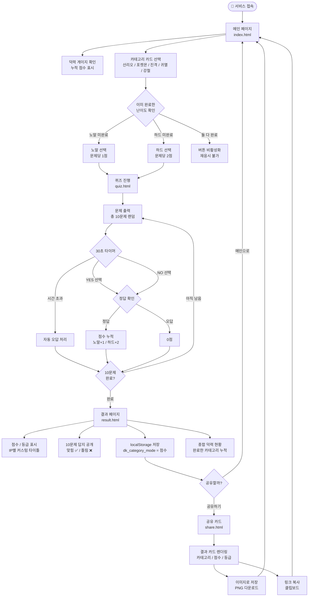
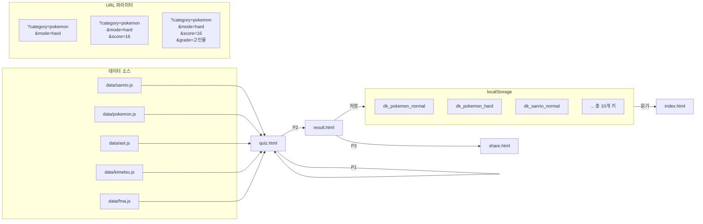

# 덕력 감별소 — Flow Chart

---

## 전체 사용자 흐름



---

## 데이터 흐름



---

## 화면 전환 요약

```
[ index.html ]
      │
      │ 카테고리 선택 + 난이도 선택
      ▼
[ quiz.html?category=xxx&mode=xxx ]
      │
      │ 10문제 완료
      ▼
[ result.html?category=xxx&mode=xxx&score=xxx ]
      │                    │
      │ 공유하기            │ 메인으로
      ▼                    ▼
[ share.html ]      [ index.html ]
      │
      │ 메인으로
      ▼
[ index.html ]
```
